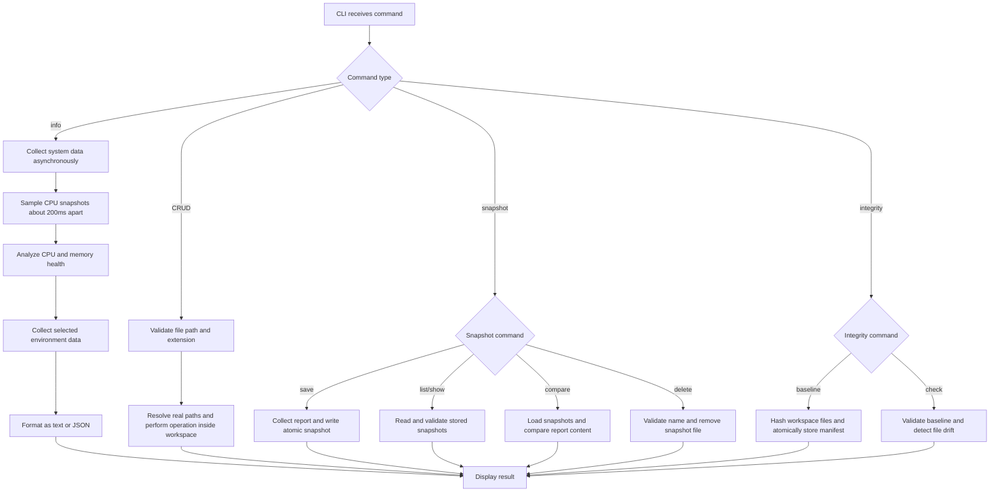

# Thunder System Sentinel

[](https://github.com/Pragun3691/thunder-system-sentinel/actions/workflows/ci.yml)

A safe Node.js command-line tool that collects system information, displays selected environment variables, and performs CRUD operations on code files inside a restricted workspace.

## Features

- Collects operating system type, release, and version
- Displays CPU architecture, model, logical cores, and real sampled CPU usage
- Samples CPU activity from two `os.cpus()` snapshots taken about 200ms apart
- Shows hostname, platform, home directory, and Node.js version
- Reports total, free, used, and percentage memory usage
- Shows load averages from `os.loadavg()` with graceful Windows handling
- Shows a safe network summary with interface name, address family, and internal status
- Omits MAC addresses and other unnecessary network identifiers
- Evaluates overall health as healthy, warning, critical, or unknown and reports CPU/memory statuses
- Explains warning and critical health reasons using clear threshold messages
- Uses an allowlist for safe environment-variable collection
- Supports text and JSON output
- Saves system report snapshots under `.sentinel/snapshots/`
- Lists, shows, compares, and deletes named snapshots
- Compares snapshot content with added, removed, and changed values
- Creates SHA-256 integrity baselines for workspace files
- Detects added, removed, and modified files against the saved baseline
- Creates, reads, updates, lists, and deletes code files
- Restricts file operations to the real `workspace` directory, including through links and junctions
- Handles missing files, duplicate files, and invalid input
- Includes automated tests using Node.js's built-in test runner

## Requirements

- Node.js 20 or newer
- npm
- Git

No third-party packages are required.

## Quick Start

```bash
git clone https://github.com/Pragun3691/thunder-system-sentinel
cd thunder-system-sentinel
npm start
```

### Windows / PowerShell note

If PowerShell blocks npm scripts with an execution-policy error (`npm.ps1 cannot be loaded`), run npm through `cmd.exe`:

```powershell
cmd.exe /d /c npm.cmd test
cmd.exe /d /c npm.cmd start -- info
```

Or skip npm and call the CLI directly (works in any shell):

```powershell
node src/cli.js info
node src/cli.js snapshot save morning_check
node src/cli.js integrity check
```

## Commands

### Display system information

```bash
npm start
npm start -- info
```

### Display JSON output

```bash
npm start -- info --format json
```

### Save a system report snapshot

```bash
npm start -- snapshot save morning_check
```

### List saved snapshots

```bash
npm start -- snapshot list
npm start -- snapshot list --format json
```

### Show a saved snapshot

```bash
npm start -- snapshot show morning_check
npm start -- snapshot show morning_check --format json
```

### Compare two snapshots

```bash
npm start -- snapshot compare morning_check evening_check
npm start -- snapshot compare morning_check evening_check --format json
```

### Delete a snapshot

```bash
npm start -- snapshot delete morning_check
```

### Create an integrity baseline

```bash
npm start -- integrity baseline
npm start -- integrity baseline --format json
```

### Check workspace integrity

```bash
npm start -- integrity check
npm start -- integrity check --format json
```

### Create a code file

```bash
node src/cli.js create example.js --content "const answer = 42;"
```

### Read a code file

```bash
node src/cli.js read example.js
```

### Update a code file

```bash
node src/cli.js update example.js --content "const answer = 100;"
```

### List code files

```bash
node src/cli.js list
```

### Delete a code file

```bash
node src/cli.js delete example.js
```

### Display help

```bash
npm start -- --help
```

## Output

The default text report includes:

- Operating system details
- CPU details and sampled CPU usage percentage
- Memory totals, used bytes, and memory usage percentage
- Load averages for 1, 5, and 15 minutes
- Safe network interface summaries without MAC addresses
- Health status and warning reasons
- Machine, runtime, uptime, and selected environment details

JSON output includes the same information structurally:

- `generatedAt`
- `system.operatingSystem`
- `system.cpu`
- `system.memory`
- `system.loadAverages`
- `system.network`
- `system.machine`
- `system.runtime`
- `health`
- `environment`

Unavailable values are represented as `Unavailable` in text-oriented fields, and unsupported load averages include a note.

## Snapshot Storage

Snapshots are stored as JSON files in `.sentinel/snapshots/`.

Each snapshot uses `schemaVersion: 1` and contains:

- `name`
- `generatedAt`
- `system`
- `health`
- `environment`

Snapshot names may contain only letters, numbers, hyphens, and underscores, up to 64 characters. The CLI rejects absolute paths, path traversal, duplicate names, corrupt JSON, missing snapshots, and unsupported schema versions.

Snapshot writes are atomic: the CLI writes a temporary file in the snapshot directory and links it into place only after the JSON payload has been fully written.

`snapshot list` returns each snapshot's name, creation time, platform, and overall health. `snapshot compare` ignores snapshot metadata such as name, schema version, and generation time, then reports content differences with `path`, `before`, and `after` fields.

## Integrity Baselines

`integrity baseline` reads every file in `workspace`, calculates a SHA-256 digest and byte size, and stores the resulting manifest in `.sentinel/integrity/baseline.json`. SHA-256 turns each file's bytes into a stable 256-bit fingerprint: changing the file changes its digest, while the original file contents are not copied into the baseline.

The baseline records its schema version, hash algorithm, generation time, file count, and portable relative file paths. It is written atomically through a temporary file and rename; temporary files are cleaned up if writing or renaming fails.

`integrity check` creates a fresh in-memory manifest and compares it with the stored baseline. It reports files as added, removed, modified, or unchanged. A clean check exits with code `0`; detected drift is still printed normally but sets exit code `1`, making the command useful in scripts and CI. Invalid or corrupt baseline metadata is rejected before comparison.

## Code Flow



1. `src/cli.js` parses the command and options.
2. The `info` command awaits the asynchronous system collector.
3. `src/systemInfo.js` samples real CPU usage, memory, load averages, network summaries, machine details, and runtime details.
4. `src/healthAnalyzer.js` evaluates CPU and memory usage against warning and critical thresholds.
5. The environment collector reads only allowlisted variables.
6. The formatter converts the full report into text or JSON.
7. File commands are passed to the file manager.
8. The file manager validates the lexical path, extension, canonical workspace root, and real target or parent path.
9. The requested file operation runs only inside the real `workspace`, even when links or junctions are present.
10. Snapshot commands validate names and operate only inside `.sentinel/snapshots/`.
11. Snapshot files are parsed and schema-checked before being shown, listed, or compared.
12. Integrity commands create or validate a SHA-256 manifest and compare current files with the baseline.
13. Success or a clear error message is displayed.

## Strategy

The project is divided into small modules with one responsibility each:

| Module | Responsibility |
|---|---|
| `cli.js` | Parses commands and coordinates the application |
| `systemInfo.js` | Collects system and runtime information |
| `healthAnalyzer.js` | Evaluates CPU and memory health thresholds |
| `environment.js` | Reads only approved environment variables |
| `snapshotManager.js` | Stores, validates, compares, and deletes report snapshots |
| `integrityManager.js` | Creates, validates, stores, and checks SHA-256 baselines |
| `fileManager.js` | Performs path- and real-path-validated CRUD operations |
| `formatter.js` | Produces readable text and JSON output |

This separation makes the program easier to test, maintain, and extend.

## Safety Decisions

Although the challenge uses the word "virus," this project is intentionally a transparent and harmless system utility.

- It does not spread, hide, persist, or communicate over a network.
- It never collects passwords, tokens, API keys, or the complete environment.
- Environment variables are selected through a fixed allowlist.
- Network output excludes MAC addresses and actual IP addresses.
- Snapshot files are stored under `.sentinel/snapshots/`, which is ignored by Git.
- Snapshot names are restricted to safe characters and resolved inside the snapshot directory.
- Snapshot writes are atomic to avoid partially written final files.
- Absolute paths and path traversal attempts are rejected.
- Existing file targets and parent directories are resolved to their real paths before CRUD operations.
- Symlink, junction, and reparse-point redirects outside the local `workspace` directory are rejected.
- Only common code and text file extensions are accepted.
- Existing files cannot be overwritten by the `create` command.
- Integrity baselines store hashes and sizes, not copies of workspace file contents.

## Missing Values and Errors

Unavailable system or environment values are displayed as `Unavailable`.

The CLI also handles:

- Missing files
- Duplicate files
- Unsupported extensions
- Unknown commands
- Invalid output formats
- Attempts to access files outside the workspace
- Invalid snapshot names
- Corrupt snapshot JSON
- Unsupported snapshot schema versions
- Missing snapshots
- Missing or corrupt integrity baselines
- Invalid integrity metadata or unsafe manifest paths
- Workspace integrity drift

Errors produce a non-zero process exit code.

## Supported File Types

`.js`, `.mjs`, `.cjs`, `.json`, `.html`, `.css`, `.ts`, `.py`, `.java`, `.c`, `.cpp`, `.md`, and `.txt`

## Testing

Run all automated tests:

```bash
npm test
```

The tests cover:

- Required system information
- Environment-variable allowlisting
- Text and JSON formatting
- CPU, memory, load average, network, and health dashboard fields
- Deterministic health threshold analysis
- Snapshot save, list, show, compare, and delete workflows
- Duplicate, invalid, missing, corrupt, and unsupported snapshot cases
- No-difference snapshot comparisons
- Injected snapshot storage directories so tests never write to real `.sentinel`
- Integrity baseline creation and SHA-256 drift detection
- Added, removed, modified, unchanged, and portable nested-path cases
- Invalid integrity dates, counts, sizes, hashes, algorithms, paths, and schema versions
- Temporary integrity-file cleanup after an atomic-write failure
- Complete file CRUD workflow
- Duplicate and missing files
- Path traversal protection
- Symlink and nested junction escape protection, with graceful `EPERM` skips where link creation is unavailable
- Unsupported extensions

GitHub Actions runs the complete test suite on both Windows and Linux with Node.js 20 and 22.

## Why This Stands Out

Thunder System Sentinel combines practical system diagnostics, repeatable snapshots, file-integrity monitoring, and deliberately constrained file editing in one dependency-free CLI. Its safety boundaries are backed by deterministic cross-platform tests rather than relying only on lexical path checks or happy-path behavior.

## Project Structure

```text
thunder-system-sentinel/
|-- src/
|   |-- cli.js
|   |-- environment.js
|   |-- fileManager.js
|   |-- formatter.js
|   |-- healthAnalyzer.js
|   |-- integrityManager.js
|   |-- snapshotManager.js
|   `-- systemInfo.js
|-- tests/
|   |-- fileManager.test.js
|   |-- formatter.test.js
|   |-- healthAnalyzer.test.js
|   |-- integrityManager.test.js
|   |-- snapshotManager.test.js
|   `-- systemInfo.test.js
|-- workspace/
|-- package.json
`-- README.md
```

## License

MIT
