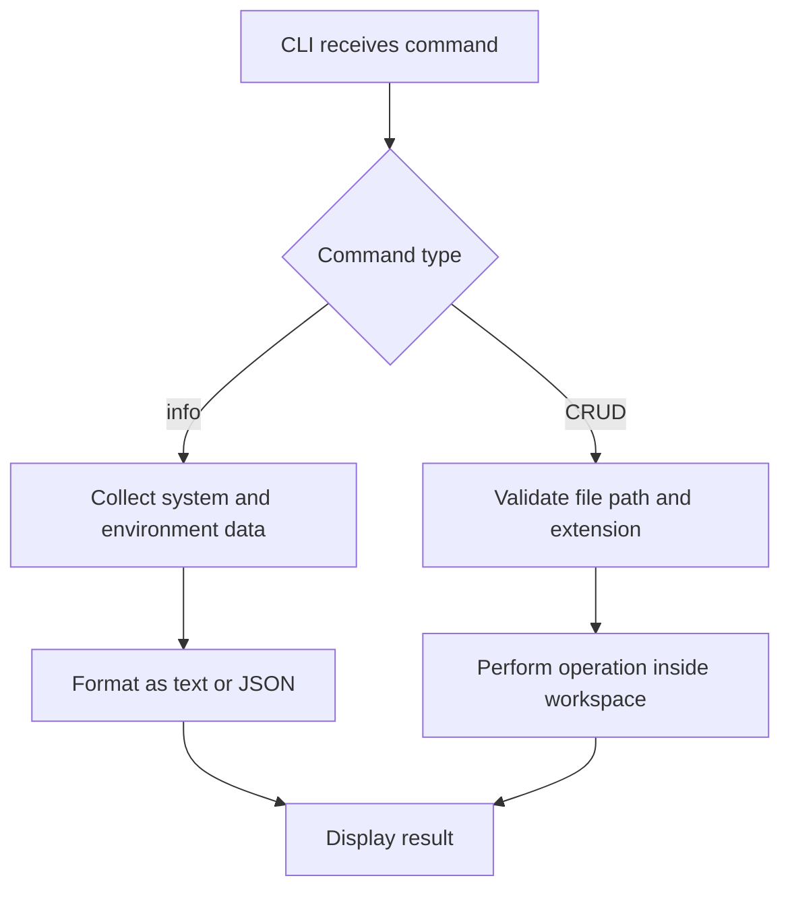

# Thunder System Sentinel

A safe Node.js command-line tool that collects system information, displays selected environment variables, and performs CRUD operations on code files inside a restricted workspace.

## Features

- Collects operating system type, release, and version
- Displays CPU architecture, model, and logical cores
- Shows hostname, platform, home directory, and Node.js version
- Reports memory usage and system uptime
- Uses an allowlist for safe environment-variable collection
- Supports text and JSON output
- Creates, reads, updates, lists, and deletes code files
- Restricts file operations to the `workspace` directory
- Handles missing files, duplicate files, and invalid input
- Includes automated tests using Node.js's built-in test runner

## Requirements

- Node.js 20 or newer
- npm
- Git

No third-party packages are required.

## Quick Start

```bash
git clone https://github.com/Pragun3691/thunder-system-sentinel
cd thunder-system-sentinel
npm start
```

## Commands

### Display system information

```bash
npm start
npm start -- info
```

### Display JSON output

```bash
npm start -- info --format json
```

### Create a code file

```bash
node src/cli.js create example.js --content "const answer = 42;"
```

### Read a code file

```bash
node src/cli.js read example.js
```

### Update a code file

```bash
node src/cli.js update example.js --content "const answer = 100;"
```

### List code files

```bash
node src/cli.js list
```

### Delete a code file

```bash
node src/cli.js delete example.js
```

### Display help

```bash
npm start -- --help
```

## Code Flow



1. `src/cli.js` parses the command and options.
2. The `info` command calls the system and environment collectors.
3. The formatter converts the report into text or JSON.
4. File commands are passed to the file manager.
5. The file manager validates the path and extension.
6. The requested operation runs only inside `workspace`.
7. Success or a clear error message is displayed.

## Strategy

The project is divided into small modules with one responsibility each:

| Module | Responsibility |
|---|---|
| `cli.js` | Parses commands and coordinates the application |
| `systemInfo.js` | Collects system and runtime information |
| `environment.js` | Reads only approved environment variables |
| `fileManager.js` | Performs validated CRUD operations |
| `formatter.js` | Produces readable text and JSON output |

This separation makes the program easier to test, maintain, and extend.

## Safety Decisions

Although the challenge uses the word "virus," this project is intentionally a transparent and harmless system utility.

- It does not spread, hide, persist, or communicate over a network.
- It never collects passwords, tokens, API keys, or the complete environment.
- Environment variables are selected through a fixed allowlist.
- Absolute paths and path traversal attempts are rejected.
- Files can be modified only inside the local `workspace` directory.
- Only common code and text file extensions are accepted.
- Existing files cannot be overwritten by the `create` command.

## Missing Values and Errors

Unavailable system or environment values are displayed as `Unavailable`.

The CLI also handles:

- Missing files
- Duplicate files
- Unsupported extensions
- Unknown commands
- Invalid output formats
- Attempts to access files outside the workspace

Errors produce a non-zero process exit code.

## Supported File Types

`.js`, `.mjs`, `.cjs`, `.json`, `.html`, `.css`, `.ts`, `.py`, `.java`, `.c`, `.cpp`, `.md`, and `.txt`

## Testing

Run all automated tests:

```bash
npm test
```

The tests cover:

- Required system information
- Environment-variable allowlisting
- Text and JSON formatting
- Complete file CRUD workflow
- Duplicate and missing files
- Path traversal protection
- Unsupported extensions

## Project Structure

```text
thunder-system-sentinel/
├── src/
│   ├── cli.js
│   ├── environment.js
│   ├── fileManager.js
│   ├── formatter.js
│   └── systemInfo.js
├── tests/
│   ├── fileManager.test.js
│   ├── formatter.test.js
│   └── systemInfo.test.js
├── workspace/
├── package.json
└── README.md
```

## License

MIT
